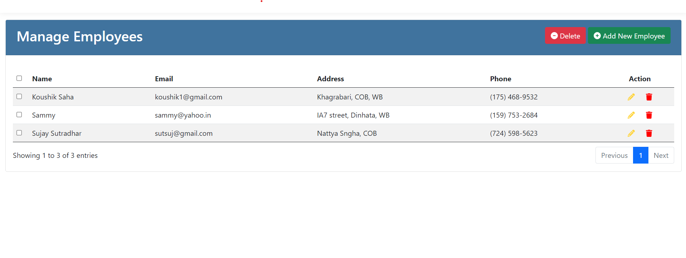

# CRUD App

- ASP.Net Core MVC
- MS SQL Server
- Entity Framework (Code First Approach).

## Setup & Run the Project

1. Clean and ReBuild the Project with internet (NuGet Packages).
2. Navigate to this project web directory in the console
3. Run this command: `dotnet ef database update`
4. Run the Project

