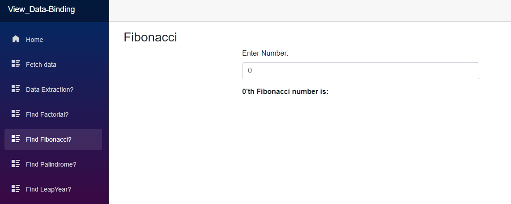

# ASP.Net Projects

<!-- Intro -->

<!--  -->

&emsp;
&emsp;
&emsp;

---

## Hashids
- A new way to encode your url parameters with HashIds Package [Source][link1001]
- This prevents your users data from exposing it makes hard to guess the next id or something.

## LoggingDemo
- ASP.Net App logging demo with `Microsoft Logging`.

## Read_ConnectionString
- Different way to Read Connection String from `Enviroment Variable`, `appsettings.json` etc.
- Read Connection String inside a Controller.

## KestrelServer
- Customize KestrelServer like `Port number`, `Section Name` etc.

## EditorConfig_Setup
- Setup a `.editorconfig` file to Reorganize the Text, Indentation, Naming convention etc.

## FluentValidationApp
- User Input Validation using Nuget Package `Fluent Validation`.
- Use Fluent Validation for different Project types `Console`, `WebApp` etc.

## WebApi
- `API_i` Project describes how we should make API Controllers standard practices etc.
- `APISecurity` Project describes Authentication & Authorization with Claim, Policy based of an API.
- `Web_i` describes Creating an API Controller inside MVC Project useful when API service is small part of the App.
- `APIMonitor` Project describes looging, Health checking and Monitoring of an API
- `APIProtection` Project describes API protection using data validation, caching and IP rate limiting.

## View Data Binding:

[link1001]: https://hashids.org/net/